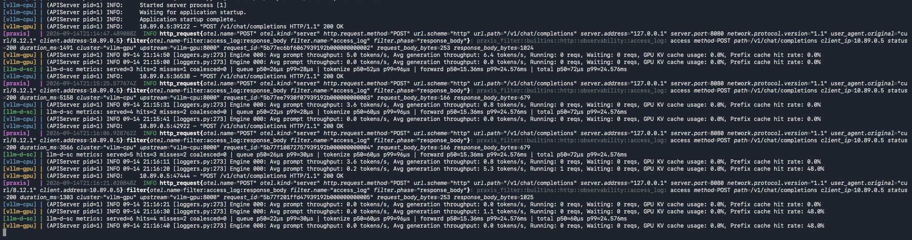
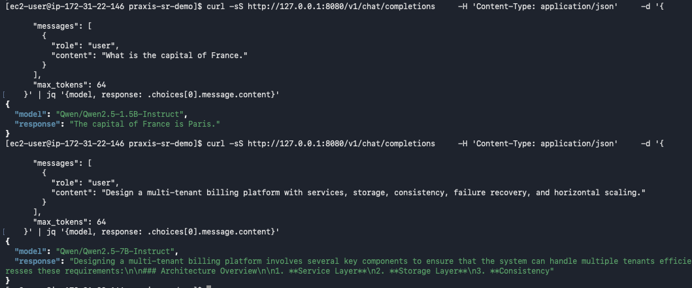
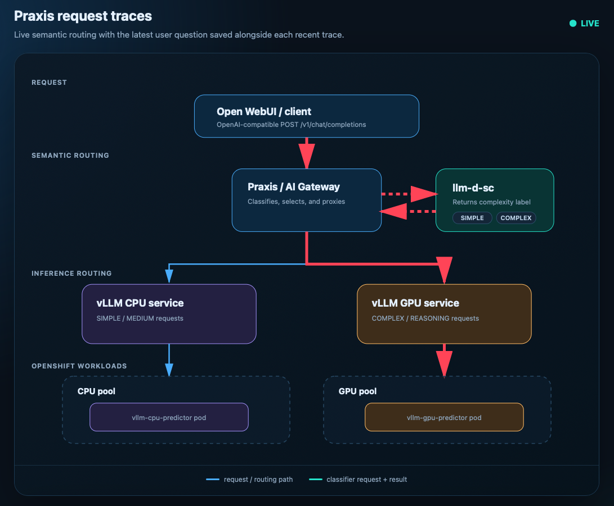
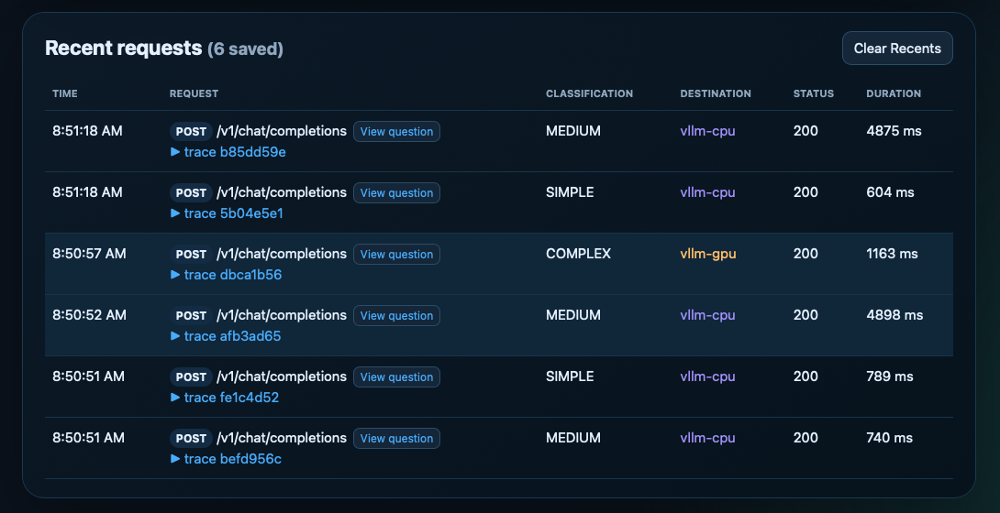

# Praxis & llm-d-sc Demo

```bash
cp .env.example .env
# edit your variables
vi .env

podman compose -f podman-compose.yaml up -d
```

And then test the stack once it's all up:

```bash
curl -sS http://127.0.0.1:8080/v1/chat/completions \
  -H 'Content-Type: application/json' \
  -d '{
    "messages": [{"role": "user", "content": "What is the capital of France?"}],
    "max_tokens": 64
  }'
```

Praxis classifies the prompt with `llm-d-sc` and routes it to the CPU or GPU vLLM backend.

## Live request traces

The local stack starts Open WebUI at `http://127.0.0.1:3000`, configured to
use the trace relay and topology at `http://127.0.0.1:8090`. Send
OpenAI-compatible traffic to the latter (for example, replace `8080` with
`8090` in the smoke request) to persist a trace.
The relay forwards the request ID to Praxis. Its internal CPU and GPU marker
ports forward Praxis's selected backend request to vLLM and identify that route
on the response, allowing the browser to highlight the observed path.
Request and response bodies are deliberately not stored; the local `trace-data`
volume retains the most recent 250 trace records.

In OpenShift, Open WebUI is configured to use the relay automatically. Build
and publish `trace-ui/Dockerfile` as `quay.io/rmalone/praxis-trace-ui:latest`
(or override the deployment image in your overlay), then open the `trace-ui`
Route to view the topology. This image name and `latest` tag are demo choices.

## Results


*Compose logs*


*Curl responses*

## Architecture

[The intended demo architecture](architecture.html)

## OpenShift stack

The OpenShift stack runs Open WebUI, Praxis, `llm-d-sc`, the trace UI, and CPU and GPU vLLM predictors. Praxis classifies each request and routes it to the appropriate predictor.




